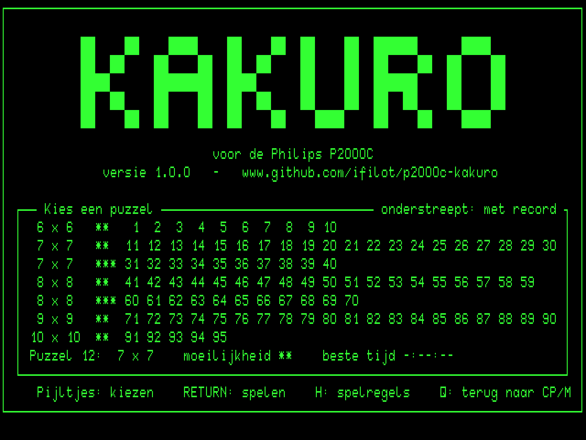
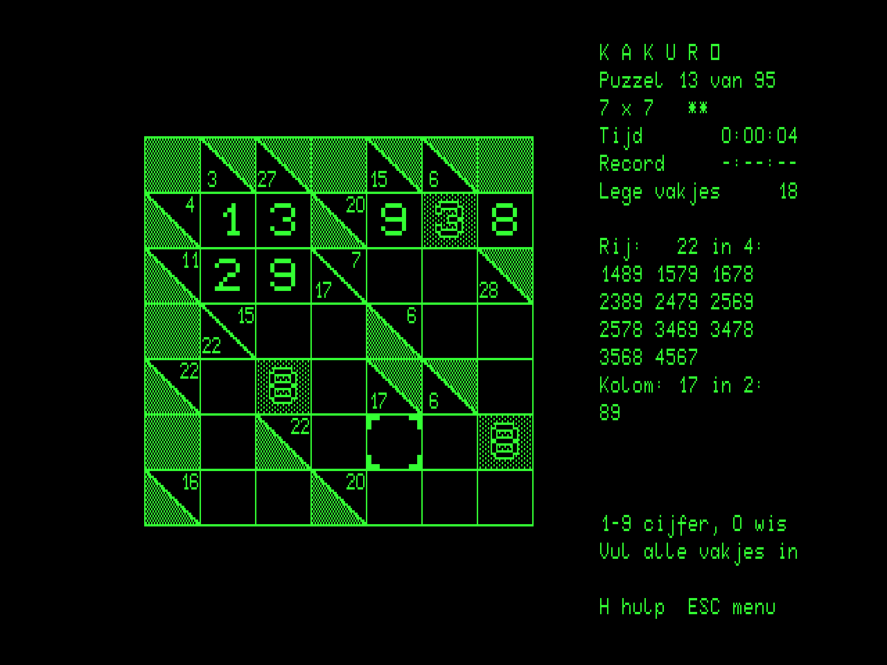
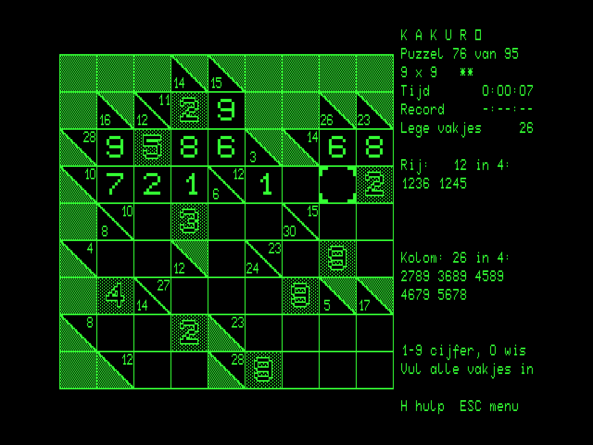
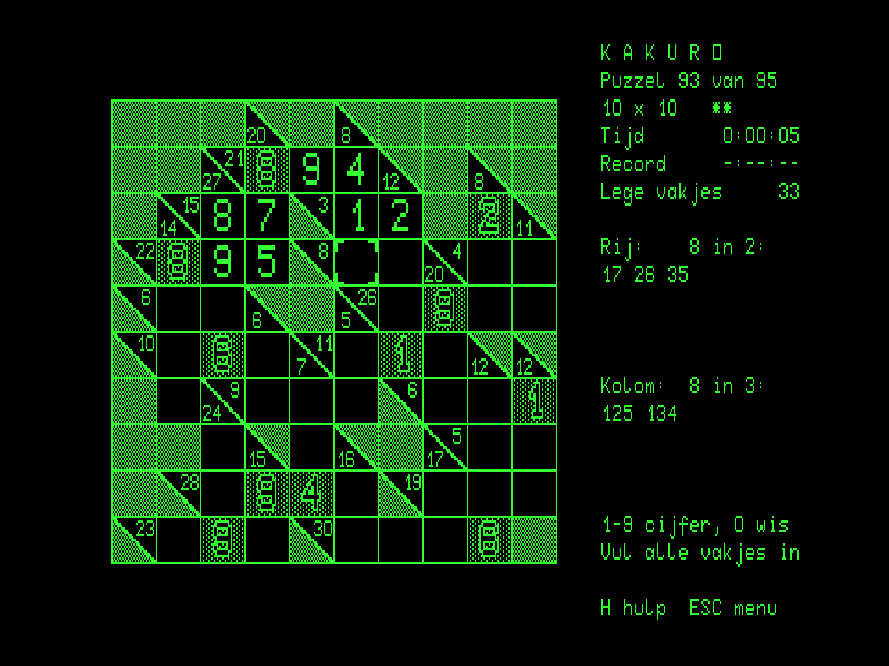
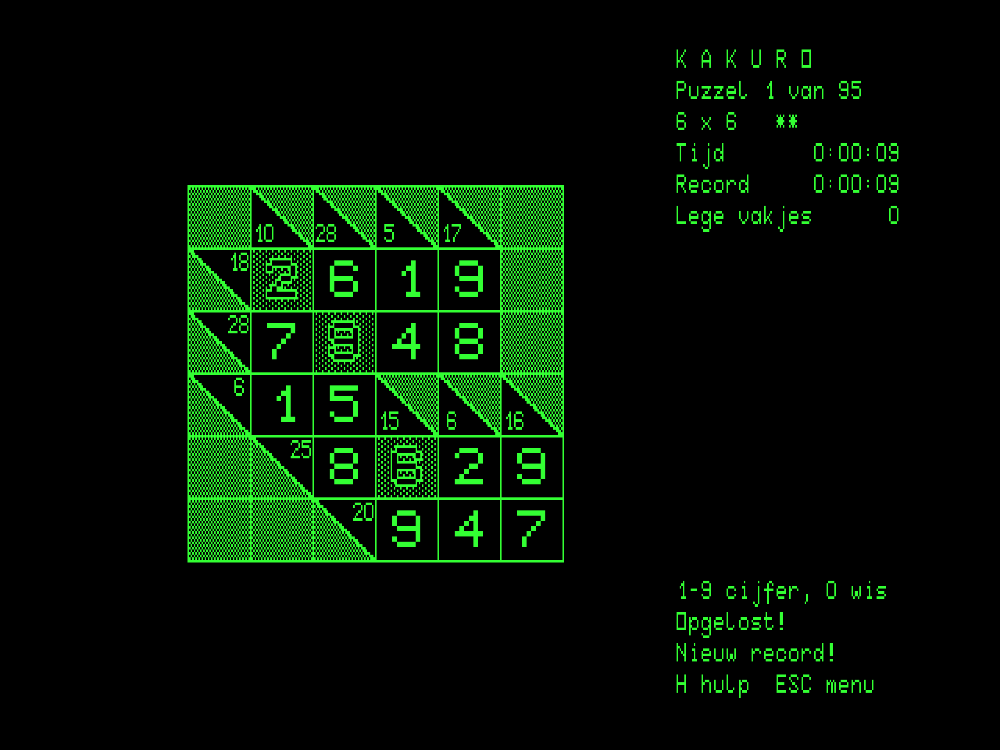
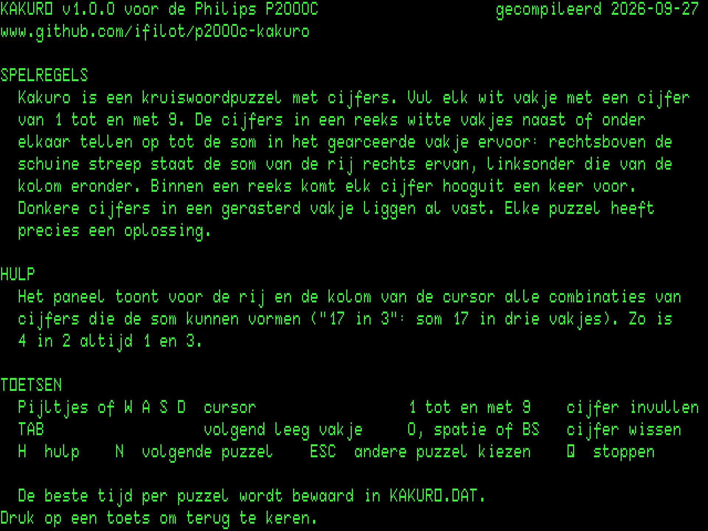

# Kakuro for the Philips P2000C

[](https://github.com/ifilot/p2000c-kakuro/actions/workflows/build.yml)
[](https://github.com/ifilot/p2000c-kakuro/releases)
[](LICENSE)

Kakuro, the number crossword, for the Philips P2000C running CP/M. There are 95
puzzles, from 6x6 to 10x10, and the best time for each one is kept.

> [!NOTE]
> **More P2000C games:** Check out [Chess](https://github.com/ifilot/p2000c-chess),
> [Battleship](https://github.com/ifilot/p2000c-battleship),
> [Minesweeper](https://github.com/ifilot/p2000c-minesweeper),
> [Othello](https://github.com/ifilot/p2000c-othello), and
> [Tetris](https://github.com/ifilot/p2000c-tetris). For an all-in-one setup
> containing the games, see the [P2000C ZuluBlaster SASI drive distribution](https://github.com/ifilot/p2000c-zulublaster-sasi-drive).

<p align="center">
  
  
</p>
<p align="center">
  
  
</p>
<p align="center">
  
  
</p>

## Play

Download `KAKURO.COM` from the [releases](https://github.com/ifilot/p2000c-kakuro/releases)
(or the latest [build artifact](https://github.com/ifilot/p2000c-kakuro/actions)),
copy it to a CP/M disk and run `KAKURO`.

The start screen (plain text, so it appears instantly) lists the puzzles in
rows of one size and difficulty. The cursor keys move the choice, shown in
inverse video with its size, difficulty and best time below the list;
`RETURN` starts it. Puzzles that have a best time are underlined.

Fill every white cell with a digit from 1 to 9. The digits of a run of
white cells, across or down, add up to the sum in the hatched cell before
it: above the diagonal the sum of the run to its right, below it the sum of
the run beneath. No digit occurs twice in a run. Dark digits in a dotted
cell are given and cannot be changed. The puzzle is solved when every cell
is filled and every run adds up; every puzzle has exactly one solution.

| Key | Action |
| --- | --- |
| Cursor keys or `W` `A` `S` `D` | Move the cursor to the nearest white cell in that direction |
| `1`-`9` | Put the digit in the cell |
| `0`, space, `BS` or `DEL` | Wipe the cell |
| `TAB` | Jump to the next empty cell |
| `H` | Help screen with the rules (plain text mode) |
| `N` | The next puzzle |
| `ESC` | Back to the start screen (another puzzle) |
| `Q` | Quit, after confirmation (immediate on the start screen) |

The panel shows the puzzle, the time spent on it, its best time and the
number of empty cells. Below that, for the cursor's row (*Rij*) and column
(*Kolom*), the sum and the number of cells (`17 in 3`) with every
combination of different digits that adds up to it (`179 269 359 368 458
467`). A cell that is the only one of its run in a direction has no sum
that way (`-`). When the last cell is filled but a run does not add up,
the panel says *Nog niet goed...*. A new best time is stored in
`KAKURO.DAT` on the current drive. Leaving a puzzle in progress with `N`
or `ESC` asks for a confirmation. After five minutes without a keypress a
screen saver blanks the picture; any key brings it back without doing
anything else. A key that repeats the previous one within a third of a
second is ignored, so a single press never acts twice; a key held down
repeats about three times a second.

## Puzzles

The puzzles come from [cx16-kakuro](https://github.com/ifilot/cx16-kakuro)
(`assets/puzzles/*.puz`).

| Puzzles | Grid (with the sums) | Difficulty |
| --- | --- | --- |
| 1-10 | 6 x 6 | ** |
| 11-30 | 7 x 7 | ** |
| 31-40 | 7 x 7 | *** |
| 41-59 | 8 x 8 | ** |
| 60-70 | 8 x 8 | *** |
| 71-90 | 9 x 9 | ** |
| 91-95 | 10 x 10 | ** |

Grids up to 9x9 use cells of 40x24 dots, the 10x10 grids cells of 32x20
dots; the P2000C's dots have a 3:5 pitch, so both are about square.

## Build

The program is C (Z88DK/sdcc) with the display driver in Z80 assembly. It
is compiled with the `z88dk/z88dk` Docker image:

```sh
make build            # -> build/KAKURO.COM
```

The other targets use the sibling
[P2000C ZuluBlaster SASI drive distribution](https://github.com/ifilot/p2000c-zulublaster-sasi-drive)
checkout (headless emulator, CP/M disk tool and images; a legacy
`p2000c-cpm-disk-tool` checkout also works) and
[p2000c-emulator](https://github.com/ifilot/p2000c-emulator) (graphical
emulator, character-ROM font):

```sh
make run              # open the game in the graphical emulator (WSLg/Linux)
make screenshot       # plain raster dumps (green on black) -> build/*.png
make test             # puzzles solved in the headless emulator
make deploy           # build/HD1_256.hda: second SASI disk with KAKURO.COM on F:
make sprites          # regenerate src/sprites.h (preview: build/sprites_preview.png)
make puzzles          # regenerate src/puzzles.[ch] from assets/puzzles
python3 tools/bench.py    # bytes over the terminal link per action
```

`make test` solves a puzzle of every size and difficulty the way a player
would, with `TAB` and the digits. It checks the puzzle in memory (cells,
givens, sums) against a model built from `src/puzzles.c`, the combinations
in the panel, every cursor step, that a given digit cannot be changed, the
solved state and the new record, and at four moments per puzzle compares
the terminal's graphics RAM with the program's framebuffer dot for dot. It
also checks a wrong filling, the confirmation when leaving a puzzle, `N`,
the inverse-video choice on the start screen, the best time surviving a
restart, and the screen saver (including that the key that ends it does not
reach the game).

## Layout

| File | Contents |
| --- | --- |
| `src/main.c` | Program flow: start screen, puzzles |
| `src/game.c`, `src/game.h` | Game state, keys, cursor movement, entering digits, the end of a puzzle |
| `src/puzzle.c`, `src/puzzle.h` | Loading a puzzle, its sums and runs, the solved test, the combinations of a sum |
| `src/puzzles.c`, `src/puzzles.h` | Generated puzzle data |
| `src/screen.c`, `src/screen.h` | Board picture: cell sizes, composing cells, the grid as lines, uploads of what changed |
| `src/panel.c`, `src/panel.h` | Panel on the text plane, with the combinations |
| `src/screens.c`, `src/screens.h` | Start and help screens (text mode) |
| `src/scores.c`, `src/scores.h` | Best times in `KAKURO.DAT` (BDOS file calls) |
| `src/clock.c`, `src/clock.h` | Game clock (h:mm:ss) from the BIOS's documented 60 Hz system timer |
| `src/saver.c`, `src/saver.h` | Key waits: screen saver after five idle minutes, doubled keys filtered |
| `src/video.asm`, `src/video.h` | Framebuffer primitives, `ESC r` uploads, change and cost scans, BIOS console I/O, BDOS call |
| `src/sprites.h` | Generated cell tiles, digits, sums and cursor |
| `assets/puzzles/` | The puzzle files from cx16-kakuro |
| `tools/` | Puzzle and sprite generators, emulator launcher, screenshots, tests, benchmark |

## License

GNU General Public License v3.0; see [LICENSE](LICENSE). The character-ROM
font sheet used only by the generator and the screenshot tooling belongs
to the [p2000c-emulator](https://github.com/ifilot/p2000c-emulator)
project.
